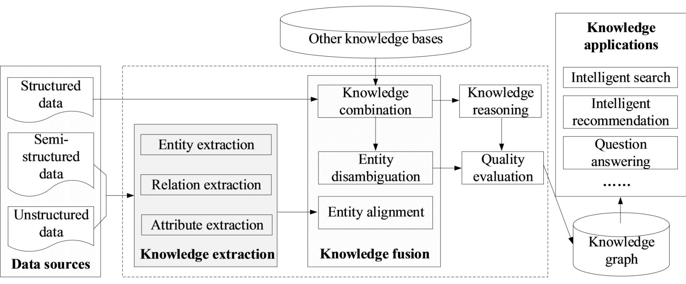
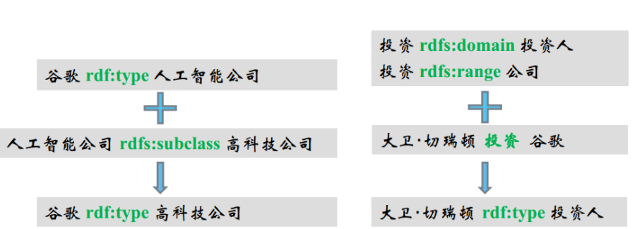

## 知识图谱简介

###### 	知识图谱的本质是链接实体间的关系图，是显示各个实体之间相互关联的语义网络，采用RDF来描述知识。Google由2012年提出了知识图谱的概念，其目的在于提高搜索引擎的搜索效率，提高用户搜索质量及使用体验。在知识图谱的构建过程中主要包括：知识抽取与知识表示，知识融合，知识推理几个关键部分。

### 知识抽取与表示

###### 构建知识图谱的首要任务，是从海量的数据中提取有效地信息并进行存储。抽取的内容主要是数据的实体、关系和属性三个部分，一般而言是将抽取的数据以RDF描述知识，并以（实体，关系，实体）或（实体，关系，属性值）的三元组形式进行存储。

###### 实体抽取即命名实体识别，他的作用是从收集到的数据中识别出命名实体。其抽取方式一般归为三种：（1）基于规则和词典的抽取方法；（2）基于机器学习的方法；（3）面向开放领域的抽取方法。

###### 关系抽取的目的是为离散的实体建立起语义链接。其抽取方式也有三种：（1）基于模板的抽取规则；（2）基于监督学习的抽取规则；（3）基于半监督或无监督学习的抽取规则。

###### 属性抽取的目的是补全实体信息，一般的实体属性可以看做实体与属性值的关系，基本可以沿用关系抽取的方式提取实体信息。

### 知识融合

###### 知识融合主要是解决构建知识图谱中因为不同数据来源之间，知识冲突和重叠的问题。因此知识融合一般分为：实体消歧，实体对齐和知识融合三部分。分别用来区分同名异意实体、在实体层面融合相似的实体数据以及在知识图谱的层面对知识进行融合。

### 知识推理

###### 知识推理可以挖掘数据中隐含的关系，从而提升知识图谱的完整性和准确性。
#### 知识图谱推理的主要方法：

• 基于描述逻辑的推理（如DL-based）
• 基于图结构和统计规则挖掘的推理（如： PRA、 AMIE）
• 基于知识图谱表⽰学习的推理（如： TransE）
• 基于概率逻辑的⽅法（如： Statistical Relational Learning）

**基于符号逻辑的推理——本体推理**

- 传统的符号逻辑推理中主要与知识图谱有关的推理手段是基于描述逻辑的本体推理。
- 描述逻辑主要被⽤来对事物的本体进⾏建模和推理，⽤来描述和推断概念分类及其概念之间的关系。
- 主要方法：
  - 基于表运算（Tableaux）及改进的⽅法： FaCT++、 Racer、 Pellet Hermit等
  - 基于Datalog转换的⽅法如KAON、 RDFox等
  - 基于产⽣式规则的算法（如rete）： Jena等

