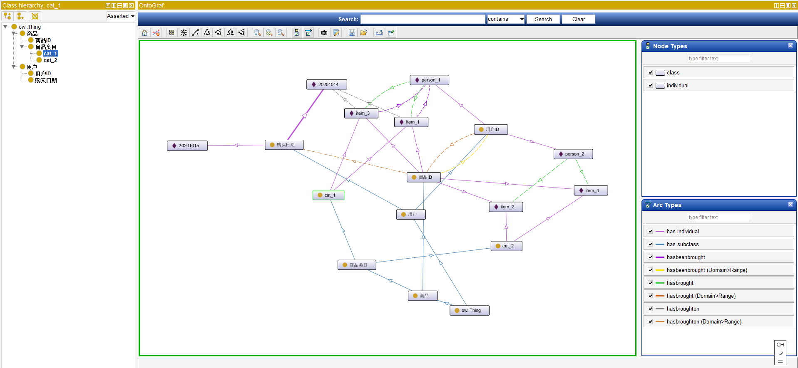
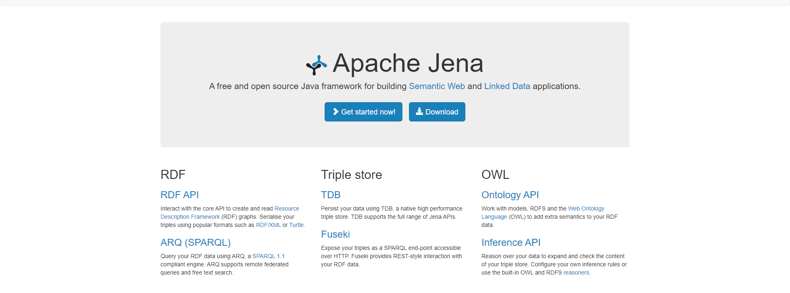
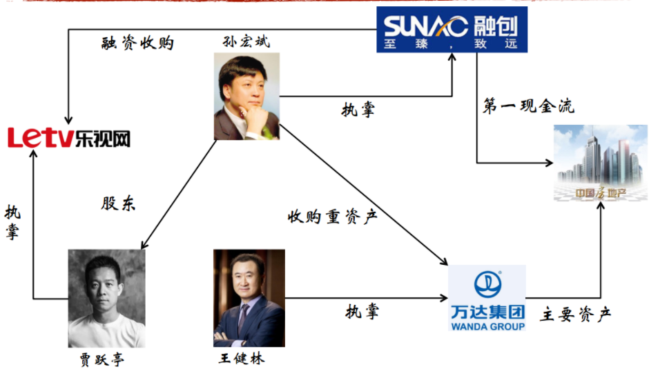

## 知识图谱构建工具学习  
### Protégé

 Protégé软件是斯坦福大学医学院生物信息研究中心基于Java语言开发的本体编辑和知识获取软件，或者说是本体开发工具，也是基于知识的编辑器。主要用于构建知识图谱的schema层。



### Deepdive  
Deepdive由斯坦福大学跨发的开源知识抽取系统。它可以通过弱监督学习，从非结构化的文本中抽取结构化的关系数据。
deepdive是从暗数据中提取信息价值的系统，是一种新型的数据管理系统，用来解决单个系统中数据提取、集成、预测等问题。暗数据是指隐藏在文本、表格、图形图像中的大量缺乏结构无法通过现有软件直接进行处理的数据类型。
Deepdive可以用于提取实体间的复杂的关系，并对涉及这些实体的事实进行判断，并帮助用户将处理完的暗数据的结果放入数据库，方便用户使用标准的工具来使用其结构化数据。

### Jena

 Jena是基于Apache的开源java框架，用于构建语义网以及实体链接。可以与protege联动。在Jena中，它提供了RDF API，Ontology API以及Inference API，帮助我们构建知识图谱，创建本体模型、创建规则，进行推理等功能。并提供了fuseki插件，可以进行web可视化的查询功能。



 因为知识图谱是由RDF来描述知识，所以Jena也提供了RDF查询语言SparQL，用于访问和操作RDF数据。例如：

`<http://www.kg.com/person/1> <http://www.kg.com/ontology/chineseName> "罗纳尔多·路易斯·纳萨里奥·德·利马"^^string.`

查询SparQL：

`<http://www.kg.com/person/1> <http://www.kg.com/ontology/chineseName> ?x.`

SPARQL查询是基于图匹配的思想。我们把上述的查询与RDF图进行匹配，找到符合该匹配模式的所有子图，最后得到变量的值。就上面这个例子而言，在RDF图中找到匹配的子图后，将"罗纳尔多·路易斯·纳萨里奥·德·利马"和“?x”绑定，我们就得到最后的结果。简而言之，SPARQL查询分为三个步骤：

1.  构建查询图模式，表现形式就是带有变量的RDF。

2.  匹配，匹配到符合指定图模式的子图。

3.  绑定，将结果绑定到查询图模式对应的变量上。

构建、规则推理代码详见目录。

### Jena推理小实例



#### 构建model
```java

Model myModel = ModelFactory.createDefaultModel();

String finance = "http://finance#";

 // 实体 

 Resource shb = myMod.createResource(finance + "孙宏斌");

 Resource rczg = myMod.createResource(finance + "融创中国"); 

...

  // 关系

  Property control = myMod.createProperty(finance + "执掌"); 

...

 // 加入三元组 

 myMod.add(shb, control, rczg); 
```

#### 添加推理机

jena推理使用的是InfModel，可以基于Model构造，实际上在原来的Model之上加了个RDFS推理机

```java
InfModel inf_rdfs = ModelFactory.createRDFSModel(myMod);
```

**• 上下位推理**

通过listStatements来获取是否有满足条件的三元组，从而实现判断，subClassOf是RDFS里的vob，因此使用RDFS.subClassOf。

```java
public static void subClassOf(Model m, Resource s, Resource o) {
    for (StmtIterator i = m.listStatements(s, RDFS.subClassOf, o); i.hasNext(); )
    {
        Statement stmt = i.nextStatement();
        System.out.println(" yes! " );
        break;
    }
}

subClassOf(inf_rdfs, myMod.getResource(finance+"地产公司"),myMod.getResource(finance+”法人实体"));

```

**• 针对类别的推理**

OWL推理机可以针对个体类别做出完备推理，即补充完整该个体的所有类别；在查询的时候，可以直接打印出所有类别！

```java
//构建owl推理机
Reasoner reasoner = ReasonerRegistry.getOWLReasoner();
InfModel inf_owl = ModelFactory.createInfModel(reasoner, myMod);

//执行类别推理
public static void printStatements(Model m, Resource s, Property p, Resource o) {
    for (StmtIterator i = m.listStatements(s,p,o); i.hasNext(); )
    {
        Statement stmt = i.nextStatement();
        System.out.println(" - " + PrintUtil.print(stmt));
    }
}
printStatements(inf_owl, rczg, RDF.type, null);

```

**• 不一致检测**

 jena的另一个常用推理就是检验data的不一致性。

```java
ValidityReport validity = infgraph.validate();
if (validity.isValid()) {
    System.out.println("\n无冲突");
} else {
    System.out.println("\n存在冲突");
    for (Iterator j = validity.getReports(); j.hasNext(); ) {
        ValidityReport.Report report = (ValidityReport.Report)j.next();
        System.out.println(" - " + report);
    }
}
```

